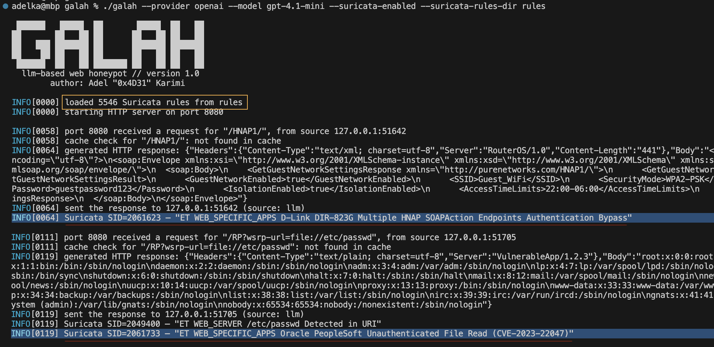

# Suricata HTTP Rule Matching (beta)

Galah can optionally inspect incoming HTTP requests against a set of Suricata rules, matching on various HTTP buffers including method, URI, headers, cookies, and request body. Note: the current implementation doesn't support all Suricata keywords, and PCRE handling is limited.

CLI Flags:
- `--suricata-enabled`: Enable Suricata HTTP rule checking (default: false).
- `--suricata-rules-dir`: Directory containing Suricata `.rules` files to load (required if Suricata is enabled).

Try it out:
1. Create a directory for the ET rules, and download the Emerging Threats `web_server` and `web_specific_apps` rules:
```bash
mkdir -p rules
curl -fsSL https://rules.emergingthreats.net/open/suricata/rules/emerging-web_server.rules \
    -o rules/emerging-web_server.rules
curl -fsSL https://rules.emergingthreats.net/open/suricata/rules/emerging-web_specific_apps.rules \
    -o rules/emerging-web_specific_apps.rules
```
2. Run Galah with Suricata enabled:
```bash
./galah -p <provider> -m <model> --suricata-enabled --suricata-rules-dir rules/
```

When enabled, Suricata rules are loaded at startup and kept in memory. For each HTTP request, the honeypot processes the following buffers in order:

- `http.method`: HTTP method (e.g., GET, POST).
- `http.uri`: Request URI (path and query string).
- `http.request_body`: HTTP request body (for POST/PUT requests).
- `http.host` / `http.host.raw`: Normalized or raw Host header or URI host.
- `http.cookie`: Cookies from the HTTP Cookie header.
- `http.header` / `http.header.raw`: All HTTP headers (normalized or raw).
- `http.user_agent`: User-Agent header.
- `http.accept`, `http.accept_enc`, `http.accept_lang`: Accept, Accept-Encoding, Accept-Language headers.
- `http.content_type`: Content-Type header.
- `http.protocol`: HTTP protocol version (e.g., HTTP/1.1).
- `http.start`: Full request line plus headers (terminated by blank line).

Supported pattern syntaxes:
- `content:"literal"`: Substring literal match.
- `|hh hh|`: Hexadecimal byte sequence match within content patterns (e.g., `|3b|` yields `;`).
- `pcre:"/regex/flags"`: PCRE regex match on the buffer. Supports the `i` flag for case-insensitive matching.
- `nocase`: Case-insensitive matching modifier for literal content.

Modifiers such as `distance` and `within` are parsed but not currently enforced. Rules with unsupported buffers or missing content matches are skipped.

All patterns specified for each buffer in a rule must match for the rule to be considered a hit (logical AND). Matching rules are logged to the console and included in the event JSON under the `suricataMatches` array, where each entry contains:
  - `sid`: Rule identifier.
  - `msg`: Rule message.

#### Example

